# scummvm-ai-upscale: real-time AI upscaling for The Curse of Monkey Island

An unofficial fork of [ScummVM](https://www.scummvm.org) 2026.3.0 that upscales **The Curse of Monkey
Island** live on your graphics card with neural networks. Every frame (backgrounds, characters, verb coin,
inventory and cutscenes) is upscaled 3× on the fly, so whatever the engine draws is upscaled exactly where it
is drawn; no pre-made art pack is needed. Room backgrounds additionally get a cleaner pass from a heavier
model in the background, characters are drawn from their full-size sprites, and subtitles stay in the game's
own font, pixel-sharp.
**True widescreen:** rooms wider than the screen show a real 16:9 view of the room; narrower rooms get an
ambient glow at the sides, or painted side art and widened cutscenes that you generate from your own copy (see
[Bring your own side art](#bring-your-own-side-art)). See [How it works](#how-it-works) for the
technical details.

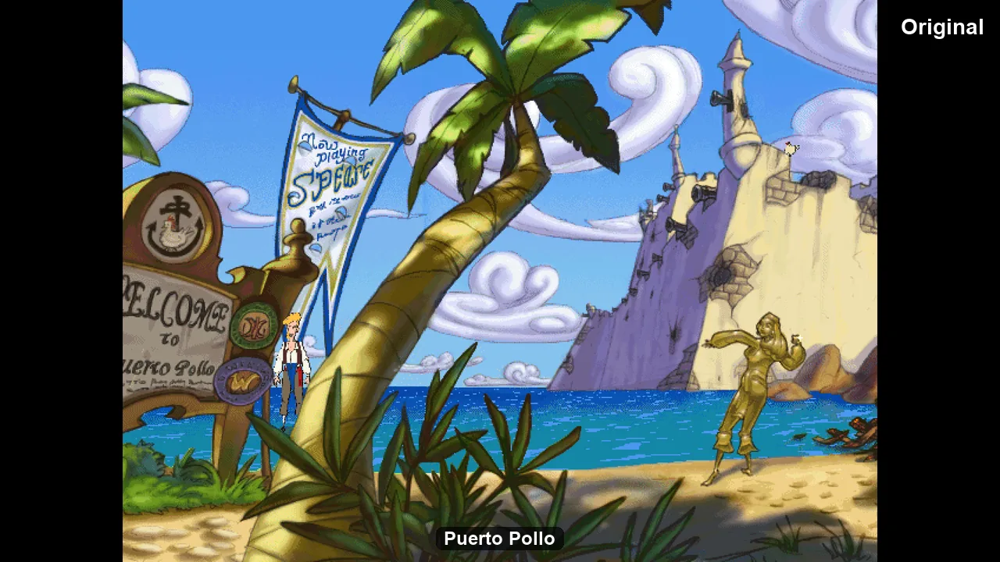

> **You need your own copy of the game** ([Steam](https://store.steampowered.com/app/730820/) or
> [GOG](https://www.gog.com/game/the_curse_of_monkey_island)). This project contains no game data.

## Bring your own side art

The download contains nothing from the game. Beside the narrow (640-wide) rooms the game shows an ambient glow
taken from the picture's edges, or **side art**: painted scenery that continues the room to 16:9. Side art is
simply a folder of images, so it can come from anywhere: hand-painted, drawn over, AI-assisted, whatever you like.
The game uses it when it's there (F12 switches between side art, ambient glow and black bars).

**Format:** a folder `sides` with one PNG per room, named by room number (`0009.png`, `0057.png`, ...), 848 pixels
wide and as tall as the room (480 for most). The middle 640 columns are the room itself: the game always draws its
own picture there, so leave them black or keep a copy of the room as a reference. Paint the 104 columns on each
side; the 24 columns either side of each join are blended into the room's edge, so continue the scene across them.
Put the folder next to `install.cmd` before installing, or set `remaster_sides_path` in `scummvm.ini`. To find a
room's number and size, take a photo in game (Shift+F9) or run `generate_sides.cmd`, which saves every room's
background to `sides-work\room_NNNN.png` as a starting point.

**Generating it:** if you'd rather not paint, `generate_sides.cmd` (also offered by the installer) makes a full set
from your own copy with an AI model of your choice: Google Gemini through your own
[OpenRouter](https://openrouter.ai) account (about 4 USD for all 57 rooms; the room backgrounds are sent to
OpenRouter/Google), or Stable Diffusion XL on your NVIDIA graphics card (free and offline, about 11 GB of
downloads). It aligns each painted side with the room and blends the join; anything it downloads stays in the
install folder's `tools` folder.

**Sharing a set:** made something you're proud of? Post a link in the
[Discussions](../../discussions) with a screenshot or two. Packs are hosted by the people who make them; to share
only your own painting, `dists/remaster/sides/strip_middle.py` blanks the room in the middle of each image first.

**Cutscenes** work the same way, as `video-sides\<VIDEO>.sides` files (side strips per frame, see
[Cutscenes](#cutscenes)). `generate_cutscenes.cmd` makes them locally with the
[AI Remaster Pipeline](https://github.com/dtaddis/ai-remaster-pipeline) and Lightricks' LTX-2.3 video model. This is
the advanced option: it needs ARP installed (its own installer), an NVIDIA card with 16 GB of VRAM or more, 32 GB of
RAM, about 150 GB of disk space and many hours.

## Widescreen

Rooms wider than the screen show a real 16:9 view. Beside the many 640-wide rooms the game shows an ambient glow
taken from the picture's edges, or painted side art if you've generated it from your own copy (see
[Bring your own side art](#bring-your-own-side-art)); the sides fade out when a character walks off a
room's edge. Below: rooms with side art.

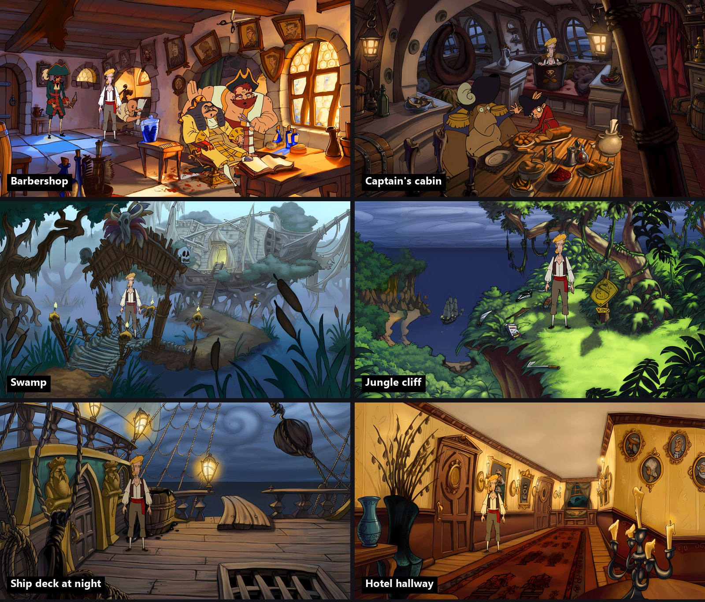

### Widescreen comparisons

The original game (640×480, 4:3, as ScummVM shows it) next to the same moment in scummvm-ai-upscale. Rooms
wider than the screen show more of the room (Puerto Pollo, the hotel, the carnival, where a character standing
just off the 4:3 picture comes into view); narrower rooms get side art if you generate it (the cliff top, the lava
bridge).

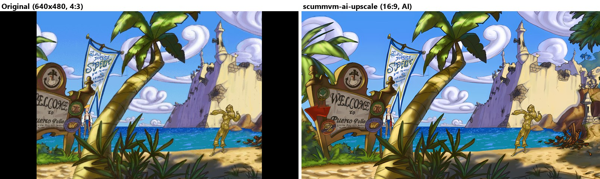
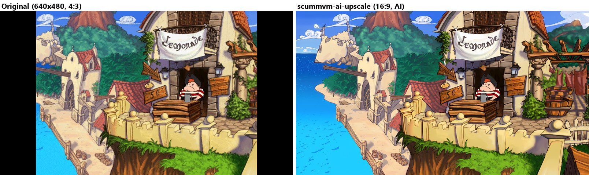
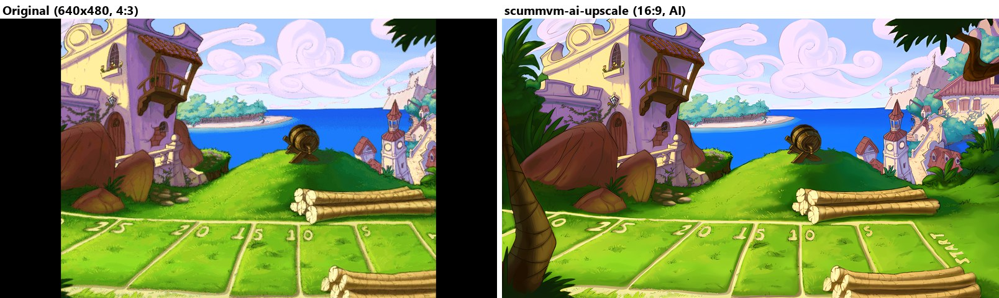
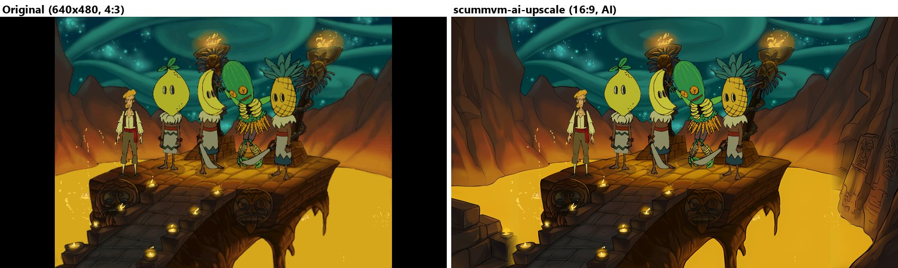
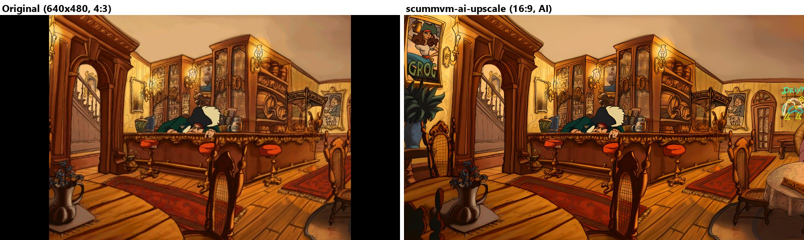
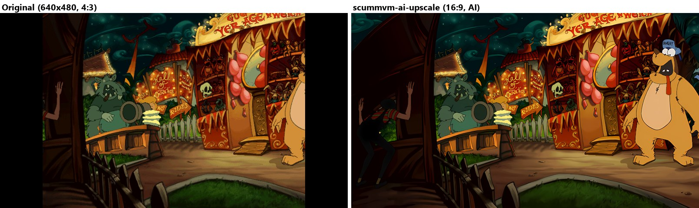

## HD characters

Characters are drawn from their full-size sprites (AI-upscaled once and cached) instead of the shrunken game
sprite, so faces and hands keep their detail when characters stand further away. Each sprite appears at once with
the real-time AI's version and is then refined in the background by the heavier HD-background model.

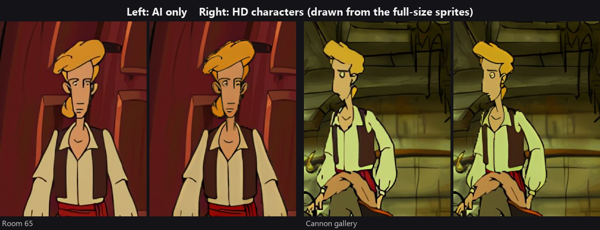

## HD backgrounds

Each room's background is upscaled once more with a heavier model (Real-ESRGAN `x4plus-anime`, too slow for
every frame) and used wherever the screen shows untouched background. Ink lines and painted detail come out
cleaner; characters, objects that changed and the interface keep the real-time AI. Switch it off in
Options > Game (*HD backgrounds*).

Like a shader cache in other games, the results are kept on disk (about 2.5 MB per room). The installer offers
to prepare all rooms up front (a few minutes; or run `prewarm.ps1` in the install folder later), so every room
is HD from its first frame. Otherwise a room is prepared on a worker thread the first time you enter it and
fades to HD within a second or two.

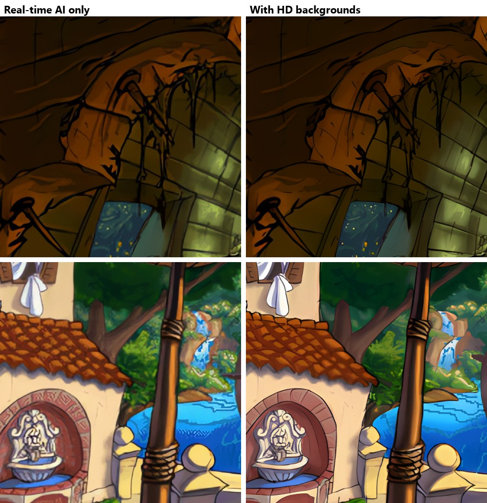

## Readable subtitles

Subtitles, dialogue choices and cutscene subtitles are not run through the AI. The game's own letters are laid
over the finished picture (in AI HD with smooth, anti-aliased outlines; in the pixel modes as exact pixel blocks;
*Smooth subtitles in AI HD* in Options > Game switches AI HD to the pixel letters too), and the picture underneath
is upscaled as if the text weren't there, so there's no smeared copy of the letters around them. This also applies in the retro display modes and
under CRT scanlines. Below: the same line before and after this change, as 2× close-ups of the output (the VGA
picture also shows the corrected palette colours, see [Retro modes](#retro-modes)).

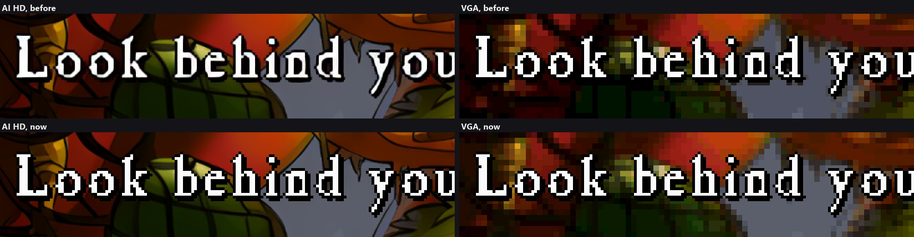

## Choose your upscaler (Ctrl+F9)

Several upscalers are built in, and **Ctrl+F9** switches between them while you play, so you can compare them on
any scene. The choice is remembered. All AI choices use the same Real-ESRGAN networks (with identical weights);
they differ in which engine runs them on your GPU, and in the network size.

| Upscaler | What it is | Whole frame on an RTX 5080 |
|---|---|---|
| **Real-ESRGAN AI (ncnn)** | The default. Vulkan, so any NVIDIA, AMD or Intel GPU | 21-27 ms |
| **Real-ESRGAN AI (DirectML)** | The same network through Microsoft's DirectML in fp16 (tensor cores on RTX cards). Any DirectX 12 GPU | 13-14 ms |
| **Ultra AI (DirectML)** | The heavy `x4plus-anime` network (the one behind the HD backgrounds) live, for everything that moves. Crisper outlines and textures; in rooms where it can't keep up it steps down to the standard network | 60-70 ms |
| **Real-ESRGAN AI (TensorRT)** / **Ultra AI (TensorRT)** | NVIDIA's own AI engine, the fastest on NVIDIA cards. Optional download in the installer (about 1.5 GB); the first time you choose it, it prepares its engines for your card in the background (about a minute per network; the standard AI is used meanwhile) | 8 ms / 61 ms |
| **AMD FSR 1 (no AI)** | AMD FidelityFX Super Resolution 1 (edge-adaptive upscaling + sharpening), for comparison. The AI-made HD backgrounds step aside while it is shown | about 3 ms |

Most frames only re-upscale the parts that changed, so the usual cost is far lower than a whole frame (town:
about 5-6 ms with the standard network, 25 ms with Ultra).

With HD backgrounds and HD characters on (the default), the heavy network already paints the backgrounds and
refines every character, so in rooms Ultra only changes moving scenery (water, fire, objects). Where it shows is
**cutscenes**: with **Ultra AI (TensorRT)** they are upscaled by the heavy network too, in real time on an RTX
5080 (about 45 ms per frame), with visibly finer lines. The standard AI is the recommended choice, and
TensorRT or DirectML simply run it faster.

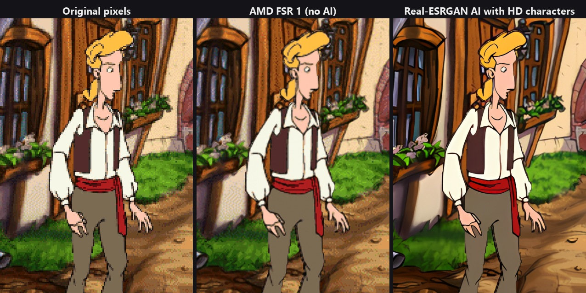

## Photo mode (Shift+F9)

Saves the scene twice in a `photos` folder next to the saves: exactly as shown (side art, HD backgrounds and
characters, no cursor), and as a poster upscaled 4x by the heavy network (3392x1920 in wide rooms, without
subtitles, made on a worker thread while you keep playing). Below: a poster scaled down, and a 1:1 crop of it.

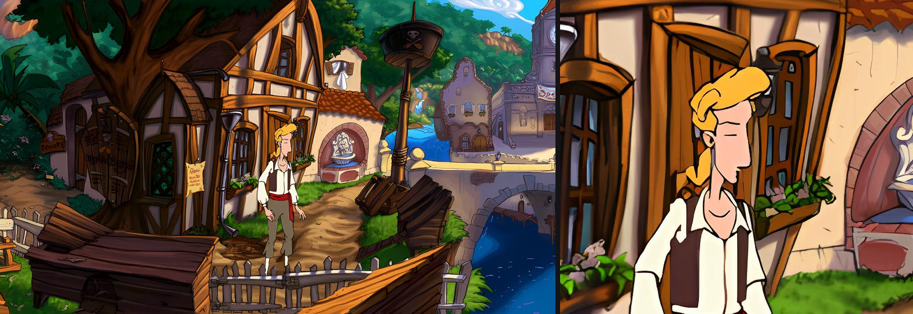

## Display options

Every option can be changed during play and is remembered. They are also available in the in-game options
(Ctrl+F5 > Options > Game).

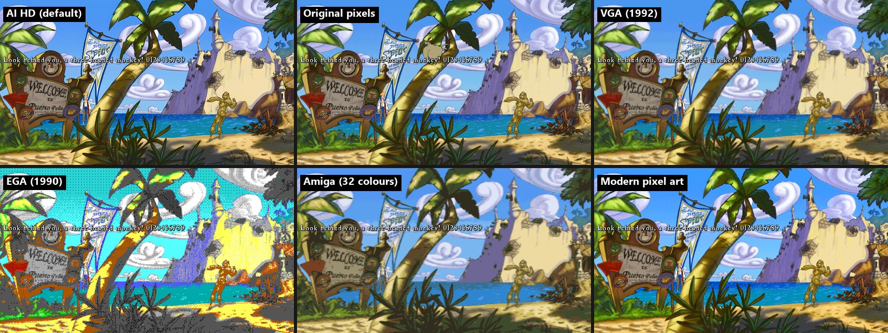

| Key | Switch |
|---|---|
| **F10** | Display mode: AI HD, Original, VGA (1992), EGA (1990), Amiga (32 colours), Modern pixel art (an experimental *Classic 320×200* mode is set in `scummvm.ini`, see [Retro modes](#retro-modes)) |
| **Ctrl+F10** | CRT scanlines over any mode |
| **F11** | AI upscaling on/off |
| **Ctrl+F9** | Upscaler: ncnn / DirectML / Ultra / TensorRT / AMD FSR (see above) |
| **Shift+F9** | Photo mode: saves the scene as shown and a poster-size 4x version (heavy model) in the `photos` folder |
| **Ctrl+Shift+F9** | Smooth scrolling (experimental): the camera glides on every screen refresh instead of stepping at the game's 12 frames per second; the character it follows and any text stay steady |
| **Shift+F11** | Grain guard on/off |
| **F12** | Widescreen sides: painted side art, ambient glow or black bars |
| **Ctrl+F12** | Report a problem: saves screenshots and details, opens a pre-filled GitHub issue |
| **Ctrl+F11** | Comparison slider: current picture on the left; on the right the original pixels, then (press again) AMD FSR, then the standard AI; hold **Ctrl** and move the mouse to drag the divider |
| **Ctrl + / Ctrl −** or **Ctrl + mouse wheel** | AI strength in 10 % steps (100 % = full AI, lower blends towards a plain smooth upscale) |

## Screenshots

The same frame, split down the middle. Left: the original 640×480 game as ScummVM shows it (4:3, black bars).
Right: scummvm-ai-upscale (16:9, AI, HD backgrounds and characters, side art).

| | |
|---|---|
| 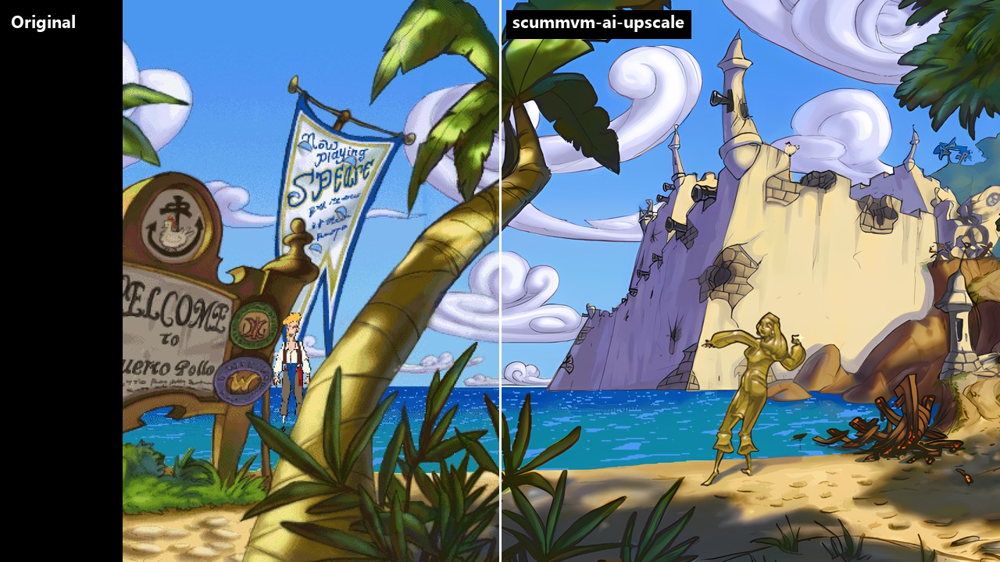 | 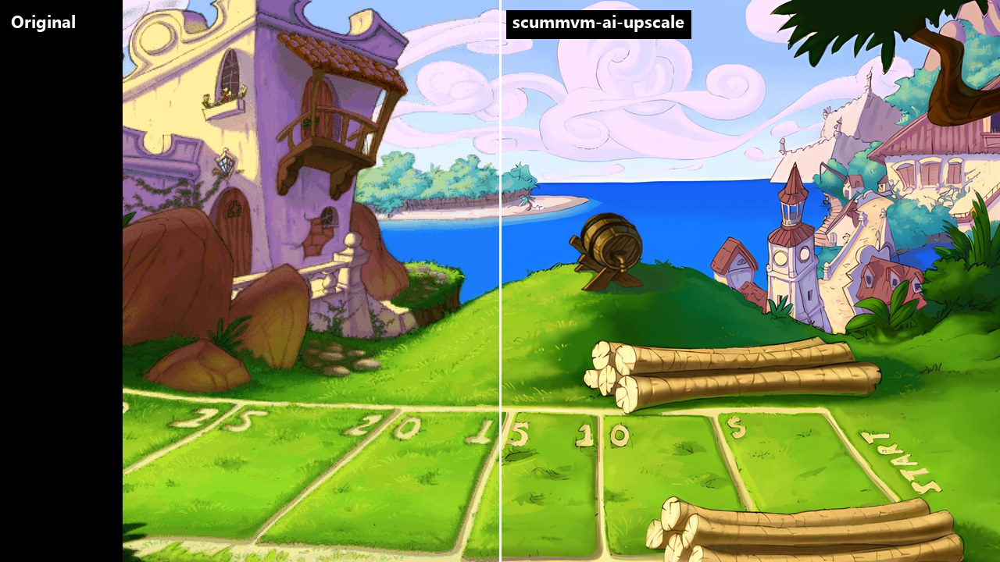 |
| 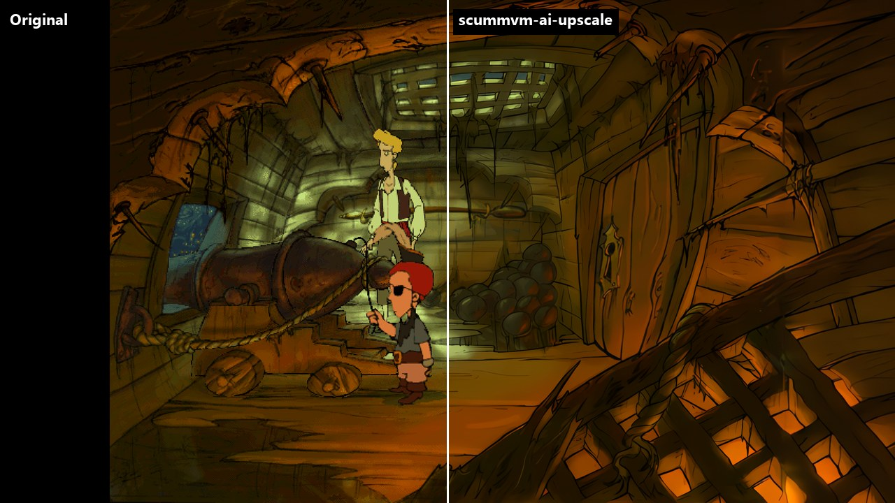 | 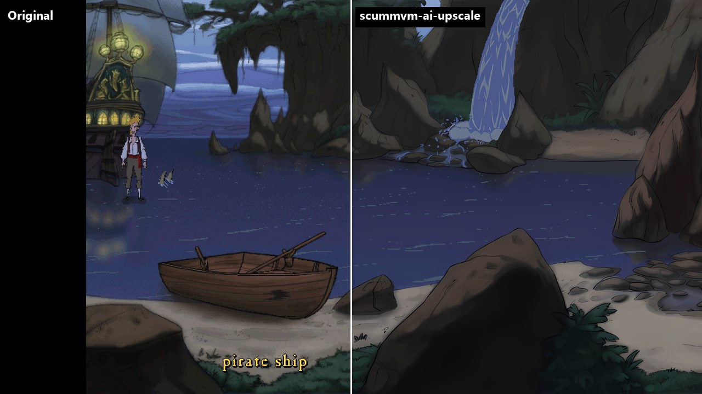 |
| 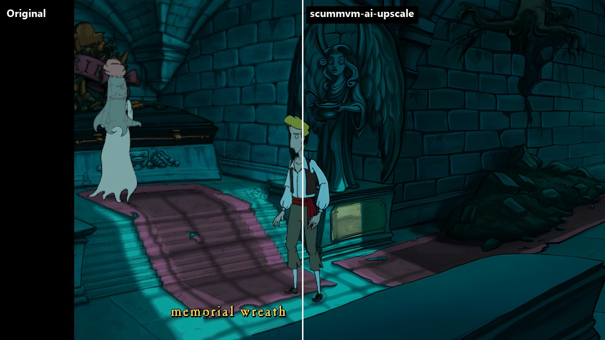 | 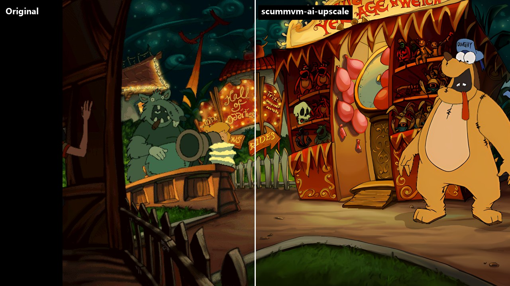 |

Close-up at the final 3× size (1:1 pixels of the 2544×1440 output):

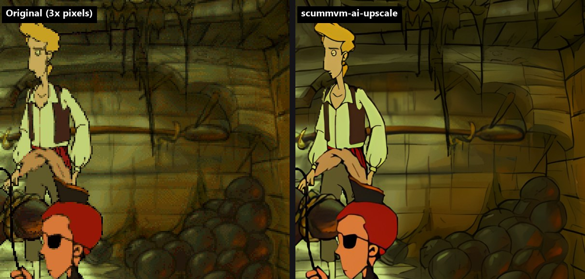

Display modes, as 1:1 close-ups of the output: AI HD, the original pixels, and calculated "demaster" looks (F10
cycles them; the experimental Classic mode is set in `scummvm.ini`):

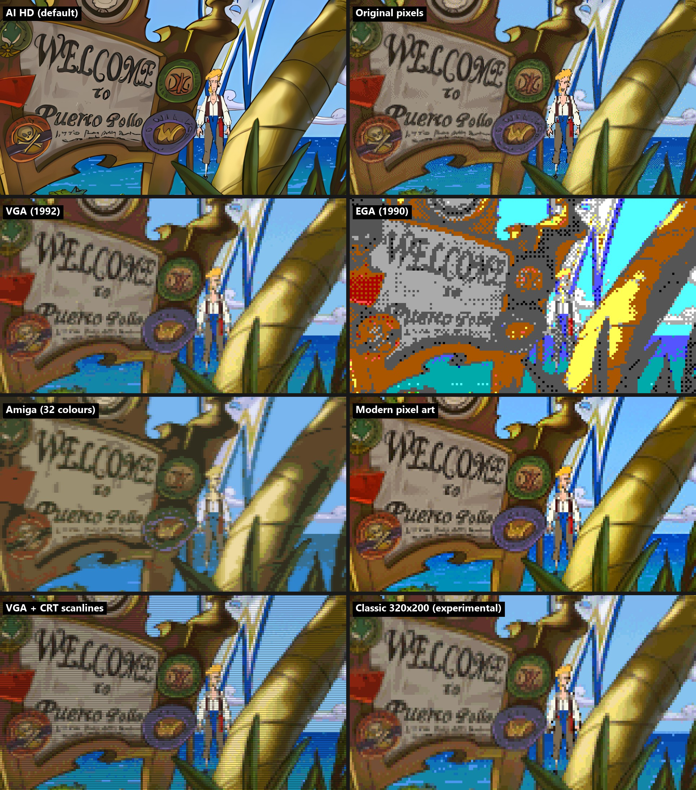

Ambient side-panel mode (`remaster_widescreen=ambient`):

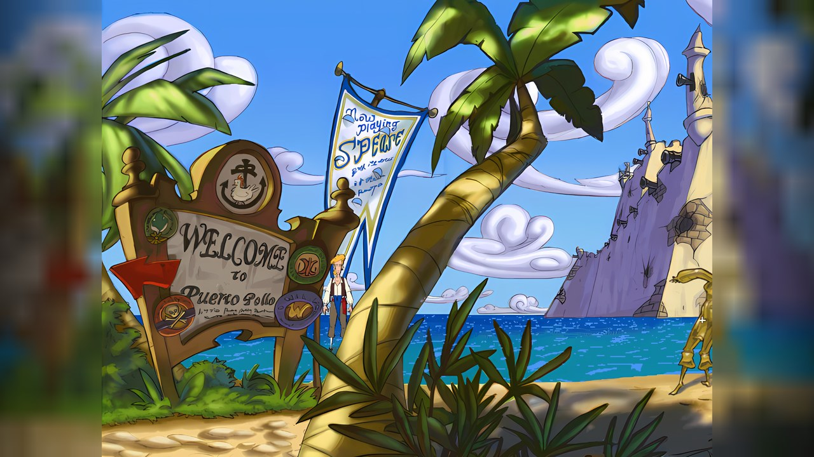

## Install (Windows)

1. Install The Curse of Monkey Island from Steam or GOG.
2. Download the latest `scummvm-ai-upscale-…-windows-x64.zip` from [Releases](../../releases) and extract it.
3. Double-click **`install.cmd`**.
   It finds your Steam or GOG copy (or asks for the folder), installs to `%LOCALAPPDATA%\ScummVM-AI-Upscale`
   and creates a desktop shortcut. Your game files are only read, never changed. It asks how you want to play:
   **Original (no AI)**, **Enhanced** (recommended) or **Experimental**. That's only a starting point: every
   setting can be changed in game (F10, F11, F12, Ctrl+F5). *Original* is for players who want no AI at all, or
   an older or low-power PC: the 1997 picture, plus the extras that need no AI (controller support, photo mode,
   the VGA/EGA/Amiga looks and CRT scanlines).

   | | Original (no AI) | Enhanced | Experimental |
   |---|---|---|---|
   | Picture | the original pixels | redrawn sharp by AI on your graphics card | as Enhanced |
   | Screen | 4:3, as in 1997 | 16:9: wide rooms show more of the room | as Enhanced |
   | Beside narrow rooms | - | a soft glow taken from the picture | painted scenery, if you make or generate it |
   | Characters and backgrounds | as in the game | extra detail (HD characters and backgrounds) | as Enhanced |
   | Cutscenes | as in the game | upscaled, with black bars | full width, if you generate them |
   | Camera | the game's steps | the game's steps | smooth scrolling (experimental) | Side art or widened cutscenes
   you've generated yourself (folders `sides` and `video-sides` next to `install.cmd`) are installed too. On NVIDIA cards it also offers the optional TensorRT upscaler
   (downloaded from Microsoft's and NVIDIA's official package pages, about 1.5 GB, under NVIDIA's licences).
4. Start **The Curse of Monkey Island (AI upscaling)** from the desktop.

**"Windows protected your PC"?** This hobby project isn't code-signed, so Windows asks once when you start
`install.cmd` from the download: click *More info* > *Run anyway* if you trust it (the full source and the build
scripts are in this repository). The installer then removes the download mark from the files it installed,
as setup programs do, so the game itself starts without a second prompt.

**Requirements:** 64-bit Windows 10/11 and a GPU with an up-to-date Vulkan driver (any recent NVIDIA,
AMD or Intel graphics). On an RTX 5080 the AI takes about 2-10 ms per frame (only changed areas are
re-upscaled). On slower GPUs, rooms that are too heavy automatically drop optional passes; you can also switch
off HD characters and HD backgrounds or use the performance mode (Ctrl+F5 > Options > Game). Without Vulkan the
game still runs, just without AI upscaling.

<details>
<summary>Manual installation / other options</summary>

- Run `install.ps1 -GamePath "D:\Games\Curse of Monkey Island"` if your copy isn't detected (the folder
  must contain `COMI.LA0` and `RESOURCE\`).
- `install.ps1 -Preset original|enhanced|experimental` applies a preset (also to an existing install, whose
  settings are otherwise kept).
- `install.ps1 -InstallDir <folder>` installs somewhere else; `-NoShortcuts` skips the shortcuts;
  `-TensorRT yes|no` answers that question in advance.
- Running the installer again updates the program and keeps your settings and saves.
- To update, download the new release and run `install.cmd` again (the game tells you when there is one).
- To uninstall, delete `%LOCALAPPDATA%\ScummVM-AI-Upscale` and the shortcuts.

</details>

## Install (Linux / Steam Deck, untested)

A Linux x86_64 build (`scummvm-ai-upscale-…-linux-x86_64.tar.gz`) is on the release page: extract it and run
`play.sh`, which finds your Steam or GOG copy.
Details, Steam Deck tips and options are in its `README.txt`
([dists/remaster/README-linux.txt](dists/remaster/README-linux.txt)). The Linux build has only been run under
WSL so far, where no GPU display is available, so the upscaling hasn't been tested on real Linux hardware or a
Steam Deck yet. Reports are welcome.

## Keys and settings

| Key | |
|---|---|
| **F10** | Cycle display mode: AI HD, Original, VGA (1992), EGA (1990), Amiga (32 colours), Modern pixel art |
| **Ctrl+F10** | CRT scanlines on/off (works with every mode) |
| **F11** | AI upscaling on/off |
| **Ctrl+F9** | Upscaler: ncnn / DirectML / Ultra (DirectML) / TensorRT / Ultra (TensorRT) / AMD FSR |
| **Shift+F9** | Photo mode (`photos` folder next to the saves): the scene as shown, plus a 4x poster (3392x1920 in wide rooms) |
| **Ctrl+Shift+F9** | Smooth scrolling on/off (experimental) |
| **Shift+F11** | Grain guard on/off |
| **Ctrl+F11** | Comparison slider (original pixels / AMD FSR / standard AI on the right) |
| **Ctrl + / Ctrl −** | AI strength |
| **F12** | Side panels: AI side art (if generated) / ambient glow / black |
| Alt+Enter | Window / fullscreen (resizable window; the Start menu also has a windowed shortcut) |
| Ctrl+F5 | ScummVM menu (save, load, options) |

**Controller** (Xbox/PlayStation layout; remappable in Options > Keymaps):

| Button | Action |
|---|---|
| Right stick | Walk Guybrush directly (slides along obstacles) |
| Left stick | Cursor (RB = slow cursor) |
| D-pad left/right | Jump the cursor to the previous/next hotspot (objects, people, exits) |
| A | Click; hold for the verb coin |
| B | Inventory |
| X / Y | Skip line / skip cutscene |
| LB / Start | Game menu / ScummVM menu |
| D-pad up / down | Display mode / side panels |
| RT / LT | AI on/off / side panels |
| L3 / R3 | CRT scanlines / report a problem |
| Back / View | Photo mode |

Settings in `scummvm.ini` (install folder):

| Key | Values |
|---|---|
| `remaster_ai_model` | path to the ncnn model, without extension (the ONNX models for the other upscalers sit next to it) |
| `remaster_ai_backend` | `ncnn` (default), `dml`, `dml-ultra`, `trt`, `trt-ultra` or `fsr` (Ctrl+F9 changes it) |
| `remaster_hd_actor_refine` | `true` (default): refine HD characters with the heavy network in the background |
| `remaster_hd_actor_cache_mb` | memory for HD characters, default `768` (least recently used are dropped first) |
| `remaster_photo_dir` | folder for photo mode (default: `photos` next to the saves folder) |
| `remaster_smooth_scroll` | `false` (default) / `true`: smooth scrolling (Ctrl+Shift+F9), experimental |
| `remaster_governor` | `true` (default): in rooms that are too heavy for the GPU, first step Ultra down to the standard network, then drop optional passes; `false` keeps everything |
| `remaster_ai_scale` | `2`, `3` (default, fits 1440p screens exactly) or `4` (the AI models are x3; x2 and x4 are resized from their output) |
| `remaster_sides_path` | folder with AI-extended side art for narrow rooms (see [dists/remaster/sides](dists/remaster/sides/README.md)) |
| `remaster_widescreen` | `wide` (default): true 16:9 view (848×480 game screen); `ambient`: 4:3 picture with ambient side panels; remove for plain 4:3 |
| `remaster_grain_guard` | `true` (default) / `false` |
| `remaster_performance` | `false` (default) / `true`: for older GPUs (2x output, no HD characters, no grain guard; the AI network itself still runs at x3 and is resized) |
| `remaster_ai_incremental` | `true` (default): only re-upscale the part of the frame that changed |
| `remaster_ai_cursor` | `true` (default): AI-upscale the cursor and held inventory items (larger cursors only) |
| `remaster_live_edge_rooms` | rooms whose animated edges (water) continue live into the side art; default `11,13` (ship's side, island map) |
| `remaster_edge_guard` | `true` (default): fade the side art when something is cut at a narrow room's edge (mainly needed in retro modes / without HD characters) |
| `remaster_update_check` | `true` (default): once a day, ask GitHub whether a newer release exists and say so in game (nothing is downloaded) |
| `remaster_ai_strength` | `0`-`100` (default `100`): how much of the AI is used |
| `remaster_hd_actors` | `true` (default): characters drawn from their full-size sprites, AI-upscaled and cached |
| `remaster_hd_backgrounds` | `true` (default): room backgrounds upscaled again with a heavier model on a worker thread |
| `remaster_bg_model` | model for HD backgrounds (default: `realesrgan-x4plus-anime` next to `remaster_ai_model`) |
| `remaster_bg_scale` | scale of that model, default `4` (its output is resampled to the game's scale) |
| `remaster_bg_cache` | folder for the HD background cache (default: `hd-cache` in the install folder); `remaster_bg_cache_enabled=false` disables it |
| `remaster_bg_prewarm` | `true`: quit once the current room's HD background is ready (used by `prewarm.ps1`) |
| `remaster_video_sides_path` | folder with widened-cutscene side strips (`<VIDEO>.sides`, see [dists/remaster/video-sides](dists/remaster/video-sides/README.md)); without it cutscenes keep black bars |
| `remaster_video_sides` | `off` to ignore the side strips (F12 also switches them, live) |
| `remaster_smooth_text` | `true` (default): in AI HD, text has smooth anti-aliased outlines; `false`: the game's crisp pixel letters (the retro modes always use those). Also in Options > Game |
| `remaster_sharp_text` | `false` (default) / `true`: text with Scale2x/3x edges instead (all modes) |
| `remaster_display_mode` | `0` AI HD, `1` original, `2` VGA, `3` EGA, `4` Amiga, `5` modern pixel art, `6` Classic 320×200 (experimental, not in the F10 cycle) |
| `remaster_crt` | `true` / `false` |
| `remaster_ai_off_rooms` | comma-separated room numbers where the AI is skipped, e.g. `25,60` |

## Reporting problems

Press **Ctrl+F12** in game. The game saves what is on screen (`screen.png`), the unprocessed game frame
(`original-frame.png`) and your settings to the `reports` folder in the install folder, opens that folder and
opens a new GitHub issue in your browser with the details filled in. Describe what looks wrong and drag
`screen.png` into the issue. (A GitHub account is needed to post; nothing is sent without you.)

## Known issues

- Grainy, dithered textures (for example the swirly background of the banjo duel) would come out speckled,
  because the network sharpens the grain. The **grain guard** (on by default, Shift+F11) detects such areas
  each frame and uses a softened normal upscale there, while characters keep the AI.
- Very heavy scenes (the cannon battle at the start: the whole picture is animated water) automatically refresh the
  AI picture on every other frame and, if that is not enough, drop HD backgrounds and finally HD characters, so the
  game keeps its speed (`remaster_governor=false` keeps everything).
- Windowed mode at sizes other than 3× scales the upscaled image again (smoothly, so pixel edges soften a
  little); fullscreen on 1440p fits exactly. On a 1080p screen `remaster_ai_scale=2` fits better, on 4K `4`.
- Smooth scrolling and the Classic 320×200 display mode are experimental.

## How it works

The game runs on ScummVM's unmodified SCUMM v8 interpreter: scripts, timing, the camera and input logic are the
original game's. The fork changes what happens to finished frames before they reach the screen, plus a few
hooks so the renderer knows what each pixel is. Most of it lives in `engines/scumm/remaster_render.cpp`
(renderer) and `engines/scumm/remaster_ai.cpp` (neural network runtime).

### Frame pipeline

```
game draws its 8-bit frame (848x480 in widescreen)          per-pixel bookkeeping recorded while drawing:
  |                                                          - which pixels are plain room background
  v                                                          - which belong to which character (costume)
palette -> 32-bit frame                                      - which are text, shadow, UI
  |                                                          - for text: the scene pixel under each letter
  +-- text taken out (each letter pixel -> the scene under it)
  +-- real-time AI upscale x3 (only the part that changed)   or a retro mode (VGA, EGA, Amiga, ...)
  +-- grain guard (softens dithered areas the AI would turn into speckle)
  +-- HD backgrounds (heavier model, made on a worker thread)
  +-- HD characters (full-size sprites, upscaled once, cached)
  +-- optional CRT scanlines / comparison slider
  +-- text laid back over the result in the game's own font, pixel-exact
  v
centre narrow rooms, fill the sides (painted art / live edges / ambient), present at 2544x1440
```

### Real-time AI upscaling

- Model: [Real-ESRGAN](https://github.com/xinntao/Real-ESRGAN)'s `realesr-animevideov3` (a small, fast
  network made for anime-style video) at 3×, run through [ncnn](https://github.com/Tencent/ncnn) on the GPU
  with Vulkan, so it works on NVIDIA, AMD and Intel. Weights and activations are stored as fp16, arithmetic is
  fp32 (fp16 arithmetic shifted colours slightly).
- **Incremental:** an adventure game frame rarely changes everywhere. Each frame is compared with the previous
  one; only the changed rectangle, grown by 16 px (the network's influence radius) plus 20 px of context, is run
  through the network and pasted into the previous output. A full refresh follows a few frames after large
  changes, so no residue can build up. Typical cost on an RTX 5080: 2-13 ms per frame.
- Changed areas are tracked on a 32 px grid and upscaled as separate rectangles, so two people walking on
  opposite sides of a room don't force one huge box. When the camera scrolls, the previous upscaled picture is
  shifted and only the newly shown strip (plus the old edge, which was upscaled without its right-hand context)
  goes through the network.
- The network's output is converted to RGBA bytes by a small compute shader of our own on the GPU, so 4 instead
  of 12 bytes per pixel come back and the CPU has nothing to convert (bit-identical to ncnn's own conversion).
- The cursor (and items held as the cursor) is upscaled with the same network; small cursors use Scale3x.
- The networks work at 3×; at the 2× and 4× output scales (`remaster_ai_scale`) their output is resized
  (area-averaged down, linearly up).

### Upscalers

- **DirectML and TensorRT** run ONNX versions of the same networks through [ONNX Runtime](https://onnxruntime.ai)
  (loaded at run time, so the game still starts without it). `dists/remaster/ncnn2onnx.py` converts the ncnn
  models with identical weights; the graph takes and returns RGBA bytes, and the network's final 4 -> 3 bicubic
  shrink is expressed as a fixed strided convolution, because DirectML has no cubic resize. Both engines are only
  fast for a fixed input size, so whole frames get their own session and changed regions are run as fixed tiles
  (96, 128, 192 or 256 px, the smallest that fits; larger regions as overlapping 256 px tiles).
- **Ultra** runs the heavy network for changed regions and the standard one for whole frames (scene changes,
  the cannon); the governor's first step in a room that is still too heavy is the standard network.
- **TensorRT** builds an engine per network and tile size for the player's GPU on a worker thread and caches it
  (`tensorrt\cache`); until then the ncnn upscaler stands in.
- **AMD FSR 1** is AMD's EASU + RCAS shader code (MIT) run as two Vulkan compute passes over plain buffers
  (`dists/remaster/fsr_gen.py` generates them from AMD's headers).

### HD backgrounds

The real-time model is chosen for speed. The room background, however, only changes when the room changes, so
the fork also upscales it with Real-ESRGAN `x4plus-anime` (a much larger RRDB network, the one usually used for
offline upscales of 2D art) and keeps the result:

- The background is captured from the game's own background buffer while the room is drawn (column strips;
  scrolling rooms are filled in as you scroll).
- It is processed in 160-pixel column tiles (with 16 px of context, internally in 128 px tiles with overlap) on a
  worker thread with its own network, one tile at a time, so the game never waits. About 0.1-0.3 s per tile.
- A tile is (re)made when its background, in its current palette colours, has been stable for 0.4 s (so fades
  and lightning don't trigger work); palette-cycling scenery is handled per pixel (below).
- The 4× result is area-resampled to the game's 3× and, at present time, used for a pixel only if the renderer
  classified it as plain room background **and** its current colour is exactly the colour the tile was made
  from. Characters, objects that changed state, text, UI, cycling colours and effects keep the real-time AI. A
  one-pixel soft transition hides the boundary, and a new tile cross-fades in.
- Results are cached as PNG per tile, named by room and a hash of the tile's exact colours, so a changed
  background (a door opened, different lighting) simply gets a new tile and a stale one is never used. On room
  entry all tiles are looked up at once; cached tiles are shown from the first frame without a fade.
  `prewarm.ps1` (offered by the installer) starts the game minimized in each room with `remaster_bg_prewarm`,
  which quits as soon as the room is done: about 5 s per room.
- Nothing is shipped: each player's machine makes its own HD backgrounds from their own copy of the game.

### HD characters

COMI stores characters as large sprites and shrinks them when they stand further away; upscaling the shrunken
result throws detail away. The costume renderer is hooked so each drawn frame ("cel") is also recorded at full
size, upscaled once by the AI and cached; a worker thread then refines each new cel with the heavy
`x4plus-anime` network (newest first) and swaps it in when ready. At present time the cel is resampled straight to output resolution and
painted where the game's frame shows that character (a per-pixel owner map is recorded while drawing), with
soft edges from the cel's own coverage, so scenery in front of a character still hides it. When the character
stops being drawn (e.g. the verb coin closes) its cel is dropped.

### Grain guard

Some backgrounds use fine dithering that the network sharpens into speckle. Grainy areas are detected from the
amount of fine pixel-to-pixel speckle, and if they make up a sizeable part of the room, those areas use a softened
conventional upscale instead. Characters are protected by the per-pixel classification (text is laid over
afterwards anyway).

### True widescreen

- The game screen is 848×480 instead of 640×480, but the camera keeps COMI's 640-pixel logic, so scripts,
  scrolling and walk boxes behave exactly as in the original; the extra columns show more of rooms that are wider
  than the screen. Mouse input is mapped back accordingly.
- Rooms only 640 wide are centred. Beside them the engine shows an ambient glow, or **side art**
  (`remaster_sides_path`, one 848-wide image per room) supplied by the player: hand-made, or generated from their
  own installation by `generate_sides.cmd`, which has the game save each room's background, lets an image model
  continue it outwards, and composites the result (`dists/remaster/sides`: fit, optical-flow alignment at the
  joins, a least-visible seam and a blend). The engine always draws the original room itself; side art only
  supplies the 104 columns on each side.
- Rooms with animated edges (water, the map's clouds) mirror their live edge rows outward with a fade, so the
  sides move with the picture. If a character or sprite is cut by the room's edge, HD characters continue it onto
  the side art; otherwise (retro modes) the side art fades out while that happens (edge guard).

### Cutscenes

COMI's cutscenes are SMUSH videos (640×480, 12 fps, 256-colour). In widescreen they are decoded into their own
640-wide buffer (ScummVM drops frames that don't match the screen size) and go through the same AI upscaler.

**Widened cutscenes (optional, made on your own PC):** the widened cutscenes are generated from your own copy of
the game with
[AI Remaster Pipeline](https://github.com/dtaddis/ai-remaster-pipeline) and Lightricks' LTX-2.3 video model
with an outpainting IC-LoRA, which paints the extra width consistently over time. This is demanding: an NVIDIA
graphics card with 16 GB or more, about 32 GB of RAM, around 100 GB of disk space (the AI models alone are about
45 GB) and several hours of processing. The tooling in `dists/remaster/video-sides`:

1. decodes each video with ffmpeg (which reads SMUSH) and splits it into shots at hard cuts, so the model never
   blends across a cut;
2. widens each shot to 16:9 (about 1 minute per short shot on an RTX 5080);
3. colour-matches the result to the real video (a per-shot 256-entry curve fitted on the shared middle), feathers
   the 16 columns next to the video into its edge, and quantises the two 104-px strips to the colours that frame
   itself uses, as palette indices, so they follow the video's own palette fades;
4. stores them zlib-compressed per frame (about 30 KB per frame).

In the game each frame is assembled as left strip + original frame + right strip into one 848-wide picture, so
upscaling works unchanged; frames without strips keep black bars, and F12 switches them live. Cutscene subtitles
are drawn by the game onto the video frame; their letters are recorded as they are drawn and kept out of the AI
like all other text.

### Retro modes

Calculated, not AI: the frame is halved to 320×240 and recoloured (VGA: the exact nearest colour of the game's
own 256-colour palette; EGA: 16 EGA colours with ordered dithering; Amiga: a 32-colour palette made per scene by
median cut; modern: richer colour and local contrast with full-resolution UI), then scaled up with hard pixel
edges. The low-resolution grid (and the EGA dither) is anchored to the room, so scrolling moves the pixels along
instead of re-sampling the background. They also work without a Vulkan GPU.

**Classic 320×200 (experimental, `remaster_display_mode=6`):** an MI2-inspired look, not an emulation of a real
port: a 320×200 artwork raster (424×200 in widescreen; set *Widescreen* to *remove* for 4:3) shown with 4:3
geometry, characters and scenery reduced separately so silhouettes stay clean, colours from the room's own palette.
Low-resolution rows are 7 or 8 output rows tall at x3 (200 rows do not divide 1440 evenly).

### Readable text

Subtitles, dialogue choices, verb texts and cutscene subtitles are kept apart from the picture: when the game draws
a letter, the pixel it covers is remembered, so the AI, the HD layers and the retro modes all work on the scene
without text, and the letters are laid over the finished picture as exact blocks of the game's own font (after CRT
scanlines, so they stay solid). No AI-smeared or averaged copy of the text is left around it, and new subtitles
cost no AI work. Text baked into a video's pictures (rather than drawn by the game) cannot be separated this way.

### Why real time instead of an upscaled asset pack?

Another common approach is to extract every background, sprite frame and font, upscale them offline and have
the engine load replacements. That gives a heavier model everywhere and needs no GPU at runtime, but it means
gigabytes of redistributed game art, and every replacement has to line up exactly with how the engine composites
the scene (overlays, scaling, palette effects). Working on the finished frame avoids both: whatever the engine
draws is upscaled in place. The HD backgrounds borrow the asset-pack idea where it pays off most, without
shipping anything.

### Problem reports

Ctrl+F12 saves the presented frame, the unprocessed game frame, the room number and the display settings,
and opens a pre-filled GitHub issue; developers can reproduce rendering problems from those files.

## Building from source

Cross-compiled on Linux (tested on Ubuntu 24.04 under WSL2):

```sh
sudo apt install build-essential cmake curl xz-utils python3
bash dists/remaster/build-windows.sh     # downloads and verifies all dependencies, builds scummvm.exe
bash dists/remaster/package.sh           # creates the release zip with licences and installer
```

The build script fetches llvm-mingw, zlib, libpng, SDL2, ncnn, ONNX Runtime and DirectML from their
official releases and checks SHA-256 digests. Output goes to `remaster-build/`.

Linux: `bash dists/remaster/build-linux.sh` then `bash dists/remaster/package-linux.sh` (native build on
Ubuntu 24.04 / Debian; see the script header for the details).

`package.sh` and `package-linux.sh` end with `check_package.py`, an allowlist of the files a release may contain;
anything else (images, cutscene strips, captures) stops the build. The side-art generator installs exact,
hash-checked package versions (`dists/remaster/sides/requirements`).

### Tests

Automated (GitHub Actions on every push, `.github/workflows/remaster.yml`; synthetic data, no game files):

```sh
g++ -O2 -std=c++11 -I. dists/remaster/tests/palette_test.cpp -o palette_test && ./palette_test   # retro colour mapping
python -m unittest discover -s dists/remaster/tests -p 'test_*.py'   # side-art generator: resume, regenerate,
                                                                    # failures, spending limit, compositor
```

The same workflow builds the Windows and Linux packages, publishes their SHA-256 checksums and a build-provenance
attestation (`gh attestation verify <file> --repo fleccy/scummvm-ai-upscale` shows which commit and workflow made it).

With the game (on your own PC): `remaster_snap_full_check=true` makes every dev snapshot (`snap.request` in
`remaster_dump_dir`) compare the incrementally updated AI picture with a fresh whole-frame run of the same input
and log the difference, with a map of where it differs.

## Licences and credits

- ScummVM and this fork: **GPL-3.0-or-later**, see [COPYING](COPYING) and [AUTHORS](AUTHORS).
  ScummVM's own readme: [README-ScummVM.md](README-ScummVM.md).
- Real-ESRGAN models `realesr-animevideov3` and `realesrgan-x4plus-anime` by Xintao Wang et al.: BSD-3-Clause
  ([licence](dists/remaster/models/LICENSE-Real-ESRGAN.txt)).
- Widened cutscenes (optional, generated on the player's PC with the tools in `dists/remaster/video-sides`):
  [AI Remaster Pipeline](https://github.com/dtaddis/ai-remaster-pipeline) (Apache-2.0), Lightricks
  [LTX-2.3](https://github.com/Lightricks/LTX-Video) (LTX-2 Community License) with an outpainting IC-LoRA by
  oumoumad, run in [ComfyUI](https://github.com/comfyanonymous/ComfyUI).
- Side art (optional, made by the player or generated on their PC with the tools in `dists/remaster/sides`).
- ncnn (Tencent): BSD-3-Clause. glslang, SDL2, zlib, libpng, LLVM/mingw-w64 runtime: see the `licenses`
  folder in the release zip.
- ONNX Runtime (Microsoft): MIT. DirectML (Microsoft): DirectML redistributable licence. AMD FidelityFX Super
  Resolution 1: MIT. All in the `licenses` folder.
- The optional TensorRT download (NVIDIA TensorRT, CUDA runtime, cuBLAS, cuDNN; ONNX Runtime GPU) is fetched by
  the installer from the official package pages and comes under NVIDIA's licences, copied to `tensorrt\licenses`.

*The Curse of Monkey Island* is a trademark of Lucasfilm Ltd. The game, its artwork and the screenshots'
subject matter are © Lucasfilm Ltd./Disney. This is a non-commercial fan project and is not affiliated
with or endorsed by Lucasfilm, Disney or the ScummVM team. Please don't file bugs about this fork with
ScummVM.
